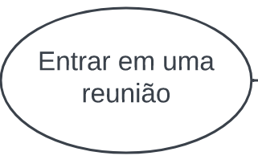
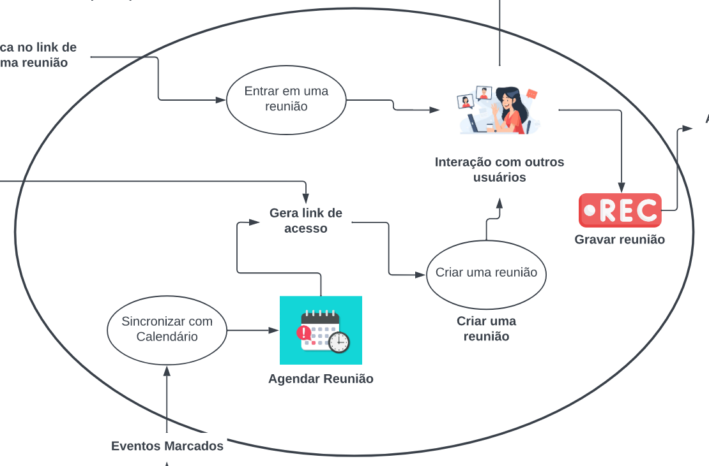

# Rich Picture

| Versão | Data       |   Modificação   |             Autor              |
| ------ | ---------- | :-------------: | :----------------------------: |
| 1.0    | 29/06/2022 | Criação do Rich Picture | Felipe Moura, Andre Alves e Gabriel Sabanai |
| 1.1.0    | 29/06/2022 | Segunda Versão do Rich Picure | Andre Alves e Felipe Moura |
| 1.1.1    | 13/07/2022 | Adição da legenda | Andre Alves |

*Tabela 1 versionamento*

## Introdução

O Rich Picture é um artefato construído afim de ilustrar e que ajuda a análisar problemas e expressar ideias.

## Metodologia

O processo consiste em ilustrar pontos principais de um problema ou objetivo e com ele descobrindo diversos fatores, tais quais: Os atores, as operações, as setas, os dados a serem armazenados e utilizados e, por fim, o limite do sistema no qual o engenheiro de software é responsável.

Com ele é possível identificar:

* Processos de negocios;
* Os atores envolvidos nos processos e suas responsabilidades;
* A relação entre os processos e atores;
* Possíveis problemas e conflitos.

Visando obter o panorama geral de como funciona o Jitsi, foi desenvolvido pela equipe o Rich Picture da visão macro do sistema, para auxiliar no entendimento da Aplicação. Foram feitos 2 rich pictures, ambos criados por integrantes do grupo (Felipe Moura e Andre Alves, respectvamente). Para criação desses se observou como o aplicativo se relaciona com seus usuários e outros stakeholders.

## Rich Picture 1 - Felipe Moura

*Imagem 1: Rich Picture, Autor: Felipe Moura, Versão: 1.0*

## Rich Picture 2 - Andre Alves

*Imagem 2: Rich Picture, Autor: Andre Alves, Versão: 1.1*

## Legenda - Rich Picture

| Componentes | Comentários |
| ----------- | ----------- |
| <h3><b>Atores</h3></b> { width=100 } | São os usuários do sistema. Um ator pode também representar um grupo de usuários e carregar qualquer número de operações. |
| <h3><b>Operações</h3></b> { width=100 } | Uma operação especifica o que o sistema faz. Cada operação pode ser executada tanto por um ator quanto por outra operação. Estão representadas como um círculo com uma descrição ou como uma imagem e uma descrição em baixo |
| <h3><b>Setas</h3></b> { width=100 } | Mostram a direção da informação que transita entre atores, armazenamentos de dados e operações. |
| <h3><b>Limites do Sistema</h3></b> { width=100 } | Identifica aquelas operações que fazem parte do sistema, ou seja, as funcionalidades que estão dentro do escopo do seu sistema. |

## Referências

“Introducing Rich Pictures” do CTEC2402 - Software Development
Project

Apresentação da aula de Requisitos - Pré-rastreabilidade -Rich Picture Aula 04.pdfArquivo. Link: https://aprender3.unb.br/pluginfile.php/2124430/mod_resource/content/4/Requisitos%20-%20Aula%2004%20-%20Parte%202%20RichPicture.pdf
